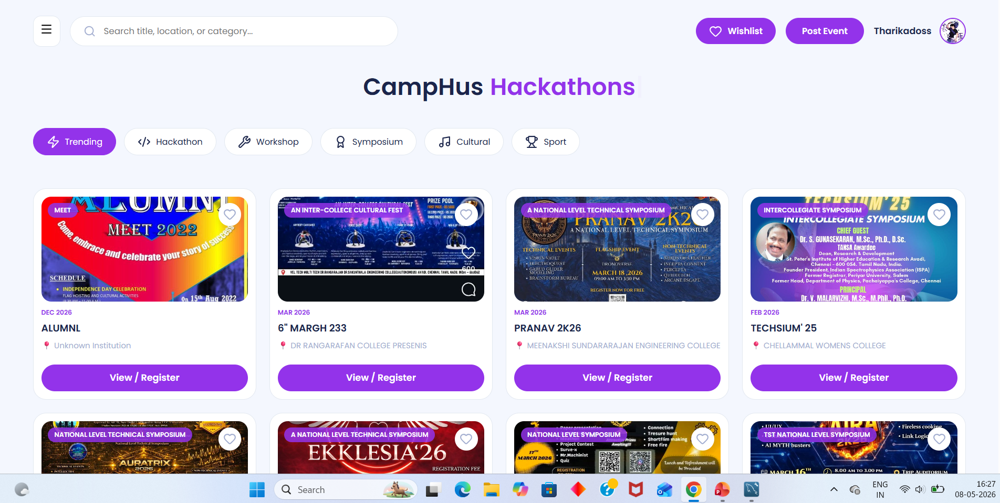
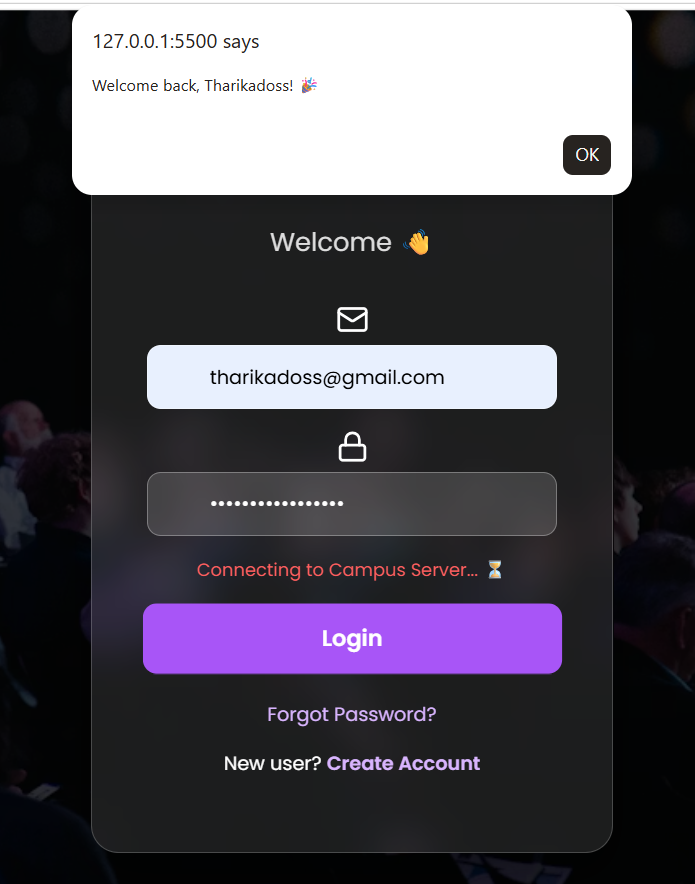
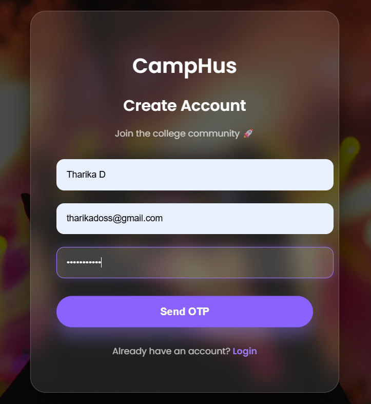
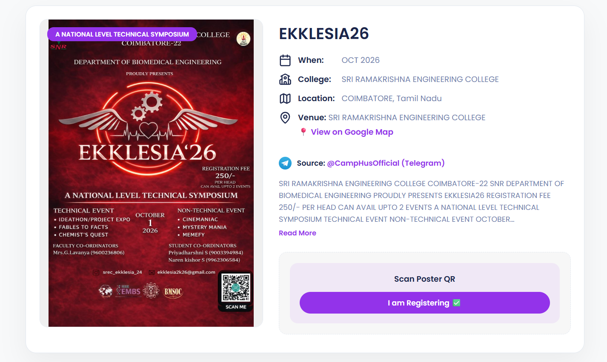
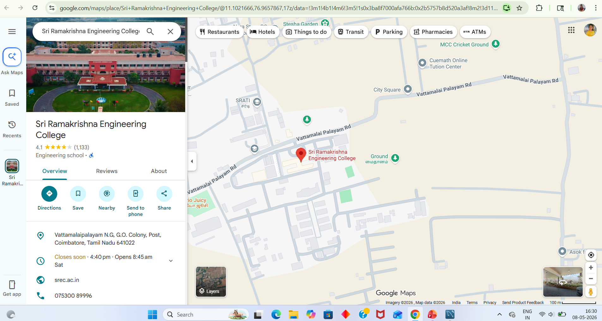
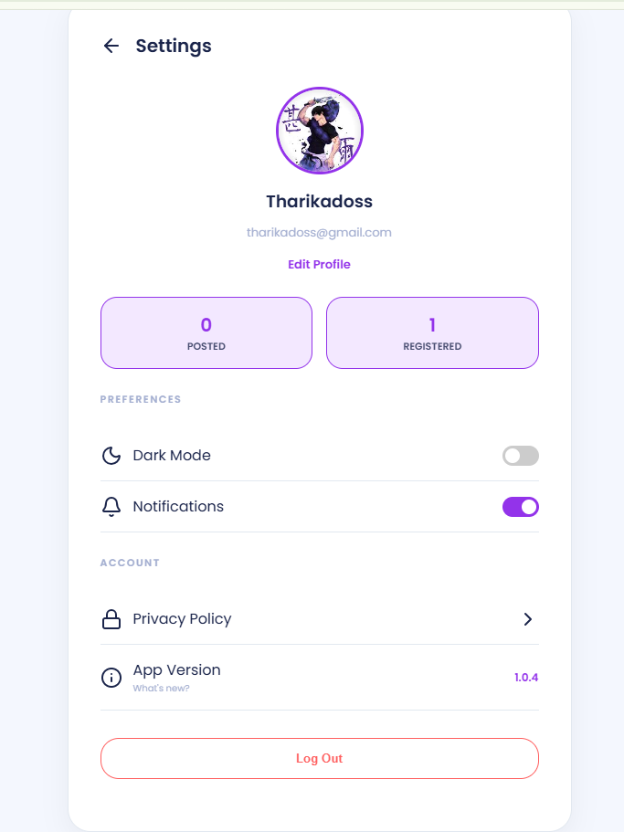
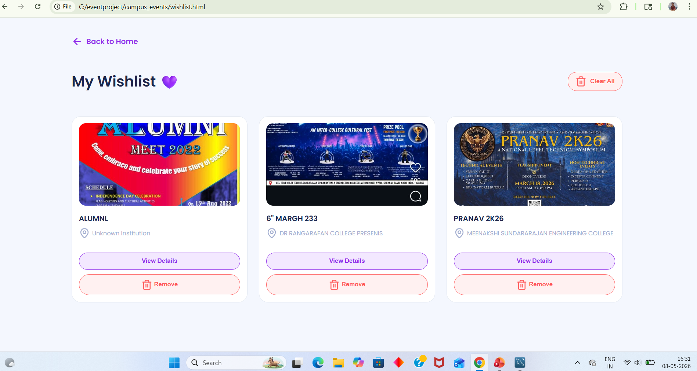
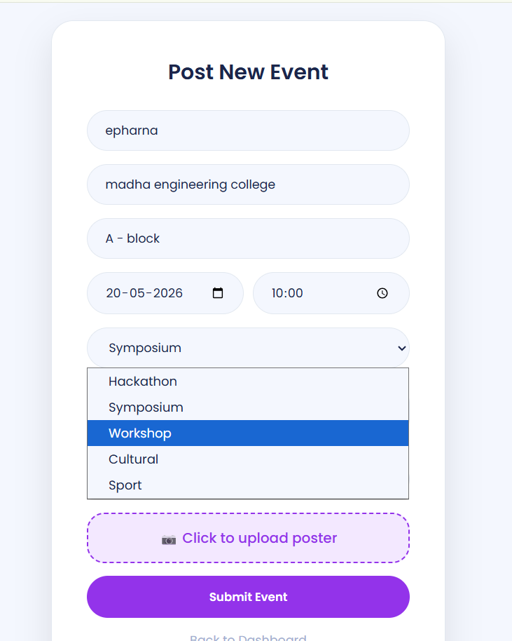

# 🎓 CampHus – College Event Aggregator

CampHus is a web-based platform that automatically collects, processes, and displays college event information from multiple social media platforms. The application helps students discover workshops, hackathons, seminars, cultural events, technical events, and other campus activities through a single centralized platform.

---

## 📌 Project Overview

College event information is often scattered across multiple Instagram pages and Telegram channels, making it difficult for students to stay updated.

CampHus solves this problem by automatically fetching event posters, extracting useful information, and displaying events in an organized and user-friendly interface.

---

## ✨ Key Features

- 📢 Automatic event aggregation
- 📸 Instagram event poster fetching
- 📱 Telegram public channel integration
- 📝 OCR-based event information extraction
- 🔍 Search and browse events
- ❤️ Wishlist for saving favorite events
- 👤 User registration and login
- ✏️ User profile management
- ➕ Post events to the platform
- 📍 Google Maps integration for event locations
- 📧 Email notification support
- 📱 Responsive user interface

---

# 🖥️ Frontend

Developed using

- HTML5
- CSS3
- JavaScript

### Frontend Pages

- Home
- Login
- Register
- OTP Verification
- Forgot Password
- Reset Password
- Event Details
- Google Map
- User Profile
- Wishlist
- Post Event
- Posted Events
- Privacy Policy
- Settings

---

# ⚙️ Backend

Developed using

- Python
- Flask

### Backend Modules

- Event Processing
- Instagram Fetching
- Telegram Fetching
- Email Service
- Database Management
- Configuration Management

---

# 🗄️ Database

- Aiven MySQL

---

# 🤖 APIs & Technologies

- Instagram
- Telegram
- OCR
- Hugging Face Spaces
- Google Maps

---

# 📂 Project Structure

```text
CAMPHUS/
│── backend/
│   ├── services/
│   ├── app.py
│   ├── config.py
│   ├── db.py
│   ├── email_service.py
│   ├── insta.py
│   ├── main.py
│   └── telegram_fetch.py
│
│── frontend/
│   ├── css/
│   ├── js/
│   ├── home.html
│   ├── login.html
│   ├── register.html
│   ├── event.html
│   ├── map.html
│   ├── wishlist.html
│   ├── post.html
│   ├── edit-profile.html
│   ├── settings.html
│   ├── forgot.html
│   ├── reset.html
│   ├── otp.html
│   ├── posted.html
│   ├── privacy.html
│   └── worklist.html
│
│── screenshots/
│── requirements.txt
│── README.md
```

---

# 🚀 Installation

## Clone the repository

```bash
git clone https://github.com/tharika-d/CAMPHUS.git
```

## Navigate to the project

```bash
cd CAMPHUS
```

## Install dependencies

```bash
pip install -r requirements.txt
```

## Run the backend

```bash
python backend/app.py
```

## Open the frontend

Open

```
frontend/home.html
```

in your web browser.

---

# 📸 Screenshots

## 🏠 Home Page



---

## 🔐 Login Page



---

## 🔑 Login Credentials


---

## 📝 New Account Creation



---

## 📅 Event Details



---

## 📍 Google Maps



---


## 📨 Telegram Posts


---

## 👤 User Profile



---

## ❤️ Wishlist



---

## ➕ Post Event



---


## 📄 Project Documentation

The complete project documentation, including system design, implementation details, and user guide, is available here:

[📑 CampHus Project Documentation](https://docs.google.com/document/d/1yauSmEh7BShIMn4q6CPkurD2gk2yy2-J/edit?usp=drivesdk)

# 🎯 Future Enhancements

- AI-based event recommendation
- Event reminders
- Event registration system
- Admin dashboard
- Mobile application
- Real-time notifications
- Event analytics
- Multi-college support

---

# 👨‍💻 Author

**Tharika doss D**

B.Tech Information Technology

---

# 📄 License

This project was developed as a Final Year Academic Project for educational and learning purposes.